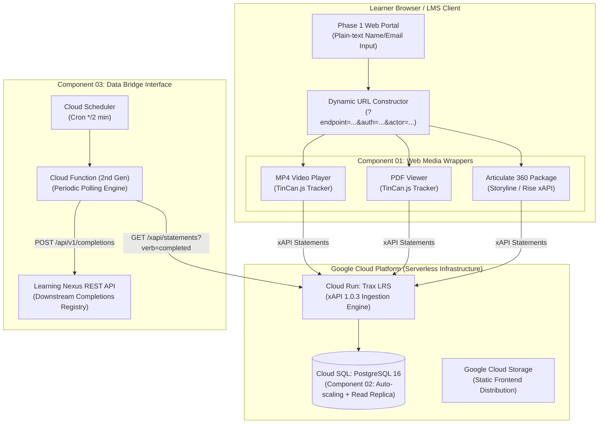

# ANTIGRAVITY PROJECT ARCHITECTURE: LRS DEPLOYMENT PIPELINE ON GCP (PROOF OF CONCEPT)

A complete, production-ready implementation of an xAPI-conformant **Learning Record Store (LRS) Pipeline** designed for Google Cloud Platform (GCP) and tested locally via Docker Compose.

---

## 📌 System Architecture Overview



---

## 🧭 Phase 1: Unsecured Web Portal Capture (Active Runtime)

### Target URL Schema
When a learner inputs their details into the portal, the **Dynamic URL Constructor** maps the parameters into the exact schema expected by **Articulate 360 (Storyline/Rise)** and standardized media wrappers:

```text
https://storage.googleapis.com/[BUCKET]/index.html?endpoint=[ENCODED_LRS]&auth=[ENCODED_CREDS]&actor={"name":["<User_Input_Name>"],"mbox":["mailto:<User_Input_Email>"]}
```

### Supported Parameters
| Query Parameter | Description | Example Value |
| :--- | :--- | :--- |
| `endpoint` | LRS statement ingestion URL (must end in slash) | `http://localhost:8000/xapi/` or `https://[SERVICE].a.run.app/xapi/` |
| `auth` | Base64-encoded basic authentication or Bearer token | `Basic cG9jX3VzZXI6cG9jX3Bhc3M=` |
| `actor` | JSON-encoded actor object (array format supported by Articulate) | `{"name":["Jane Doe"],"mbox":["mailto:jane@example.com"]}` |
| `activity_id` | Unique URI identifying the learning asset | `http://lrs-poc.internal/activities/compliance-video` |

---

## 🎛️ Core Telemetry Components

### COMPONENT_01: Web Media Wrappers & Articulate 360 Compatibility
- **MP4 Video Player Wrapper** (`media-wrappers/video/`): Uses `TinCan.js` to dispatch:
  - `launched`: On initial play
  - `progressed`: At 25%, 50%, and 75% quartiles (debounced)
  - `completed`: At 100% (or 95% threshold) with duration metadata
- **PDF Reader Wrapper** (`media-wrappers/pdf/`): Dispatches `launched`, `progressed` on page changes, and `completed` upon reading the final attestation page.
- **Articulate 360 Native Parser** (`media-wrappers/articulate-mock/`): Emulates native Storyline 360 / Rise 360 query string parsing.

### COMPONENT_02: Cloud SQL Auto-scaling & GCP Deployment
- **Terraform IaC** (`infrastructure/terraform/`):
  - Cloud SQL PostgreSQL 16 instance with `disk_autoresize = true` and `disk_autoresize_limit = 1000`.
  - Configurable machine sizing (`db-custom-1-3840` for standard, `db-f1-micro` for low testing costs).
  - Reserved **Phase 2 horizontal read-replica pathway** (`enable_read_replica = true`).
  - Cloud Run Trax LRS container with private Cloud SQL volume mount.
  - GCS bucket configured for static web hosting with CORS.

### COMPONENT_03: Data Bridge Interface
- **Serverless Poller** (`data-bridge/index.js`):
  - Queries Trax LRS `/xapi/statements` filtering for `completed` or `passed` verbs.
  - Maintains state watermark (`watermark.json` or Cloud Storage) to prevent duplicate syncs.
  - Dispatches completions to the **Learning Nexus REST API** (`POST /api/v1/completions`) with exponential backoff retries.

---

## 🚀 Phase 2: Authenticated System Hardening (HIPAA & HITRUST Blueprint)

Located in [`phase2-hardening/`](phase2-hardening/):
1. **Zero Cleartext PII in URLs**:
   - The user authenticates into the Healthcare Platform session layer.
   - An ephemeral **JSON Web Token (JWT)** with a **60-second Time-To-Live (TTL)** and an opaque UUID is generated.
   - Modules are launched passing only `?lti_token=<JWT>`.
2. **Google Cloud Armor**: WAF inspection and DDoS rate-limiting on incoming telemetry.
3. **GCP API Gateway**: OpenAPI specification (`api-gateway-config.yaml`) validating token signatures and TTL.
4. **Private VPC Token Exchange**: Resolves opaque UUIDs to learner schemas inside the private VPC security boundary before writing to Trax LRS.

---

## ⚡ Quickstart & Local Verification (Docker Compose)

You can launch and test the entire telemetry loop locally without deploying to GCP first:

### 1. Start the Stack
```powershell
docker compose up -d
```

Services started:
- **Web Portal & Launchpad**: `http://localhost:8088/portal/index.html`
- **Mock Trax LRS**: `http://localhost:8000/xapi/`
- **Learning Nexus Dashboard**: `http://localhost:4000/dashboard.html`
- **Data Bridge Poller**: Background worker running every 3 seconds

### 2. Run Automated Verification Test
```powershell
docker run --rm --network host -v "${PWD}:/app" -w /app node:20-alpine node scripts/test-pipeline.js
```

### 3. Manual Interactive Verification
1. Open `http://localhost:8088/portal/index.html` in your browser.
2. Enter a Name (e.g. `Jane Doe`) and Email (`jane.doe@hospital.org`).
3. Select the **Video** or **PDF** module and click **"Launch in Frame"**.
4. Watch/seek through the video or flip through the PDF pages.
5. Open `http://localhost:4000/dashboard.html` to watch the completion appear in real-time.

---

## ☁️ Deploying to Google Cloud Platform

```powershell
# From PowerShell
./infrastructure/gcp-deploy.ps1 -ProjectId "your-gcp-project-id" -Region "us-central1"
```
Or with Bash:
```bash
./infrastructure/gcp-deploy.sh "your-gcp-project-id" "us-central1"
```
