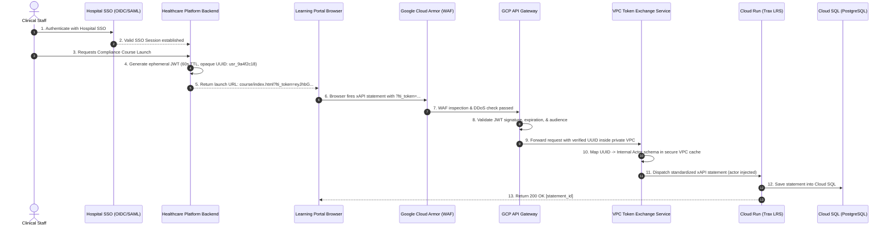

# Phase 2 Specification: Authenticated System Hardening (HIPAA & HITRUST Blueprint)

## Executive Summary & Compliance Context

Phase 2 transitions the LRS Deployment Pipeline from the Phase 1 public proof-of-concept into a zero-trust, enterprise-grade architecture compliant with **HIPAA Security Rule (45 CFR Part 160 and Part 164, Subparts A and C)** and **HITRUST CSF v11**.

In Phase 1, learner identity is transmitted directly via URL query parameters (`actor={"name":["..."],"mbox":["mailto:..."]}`). In Phase 2, **all Protected Health Information (PHI) and Personally Identifiable Information (PII) are eliminated from URL query parameters, browser histories, proxy logs, and public transit**.

---

## 🔒 Security Architecture Principles

1. **No Cleartext PII in Transit**:
   - URLs never contain learner names, emails, employee IDs, or clinical identifiers.
   - Launch requests pass only an opaque, cryptographically signed JSON Web Token (JWT) with a 60-second Time-To-Live (`?lti_token=...`).

2. **Perimeter Defense via Google Cloud Armor**:
   - Web Application Firewall (WAF) rule sets protecting against OWASP Top 10 vulnerabilities (SQLi, XSS, SSRF).
   - Rate limiting and geographic IP filtering to protect LRS ingestion endpoints from distributed denial-of-service (DDoS) and brute-force attacks.

3. **GCP API Gateway Signature Verification**:
   - API Gateway acts as the public boundary proxy.
   - Decodes and validates the cryptographic signature, issuer, audience, and TTL of the JWT before allowing requests into the private Google Cloud network.

4. **Private VPC Security Boundary**:
   - The Trax LRS Cloud Run service and Cloud SQL PostgreSQL instance communicate exclusively over private VPC connectors (Internal IP addresses).
   - Public IPs on Cloud SQL are completely disabled.
   - A dedicated **Token Exchange Microservice** within the private VPC resolves the anonymous UUID into the internal learner profile required by xAPI.

---

## 🔄 Phase 2 Authentication & Telemetry Flow



---

## 📜 Cryptographic Token Specification

### JWT Header
```json
{
  "alg": "RS256",
  "typ": "JWT",
  "kid": "key_2026_09_healthcare"
}
```

### JWT Payload
```json
{
  "iss": "https://auth.hospital-platform.org",
  "sub": "usr_9a4f2c18-912b-4ec5-b1a8-99d701a89c33",
  "aud": "https://lrs-gateway.internal.hospital.org",
  "exp": 1726000060,
  "nbf": 1726000000,
  "iat": 1726000000,
  "jti": "tok_58f12a93-b258-48b9-bb89-53e390c9b0e1",
  "scope": "xapi:statement:write",
  "activity_id": "http://lrs-poc.internal/activities/compliance-video-module"
}
```

> [!IMPORTANT]
> The `sub` field contains only an opaque, non-reversible UUID. Even if a URL is captured in browser history or reverse proxy access logs, no employee identity can be derived from it.

---

## 🛡️ Cloud SQL Read-Replica Scaling (Under High Concurrency)

When transitioning to enterprise scale (e.g. 50,000+ simultaneous staff members completing annual mandatory compliance training):

1. **Write Traffic (Statements POST)**: Routes directly to the Primary Cloud SQL PostgreSQL instance (`POST /xapi/statements`).
2. **Read Traffic (Data Bridge & Nexus Dashboards)**: Routed to the horizontal Read-Replica instances (`GET /xapi/statements`).
3. Managed via the Terraform configuration toggle:
   ```hcl
   enable_read_replica = true
   ```
